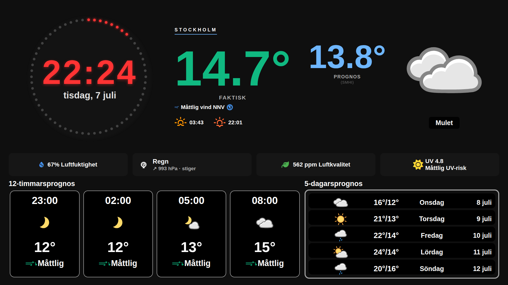

# 🌤️ Flask Weather Dashboard

**Version 3.9.1** · [Changelog](CHANGELOG.md)

🌐 [English](readme.md) · [Svenska](readme.sv.md) · [Norsk](readme.nb.md) · [Dansk](readme.da.md) · [Suomi](readme.fi.md) · **Deutsch** · [Français](readme.fr.md) · [Español](readme.es.md)

> Dies ist eine Kurzfassung. Die vollständige Dokumentation (Installation, UV-Einrichtung, Fehlersuche) gibt es in der [englischen](readme.md) und [schwedischen](readme.sv.md) Ausgabe.

Ein modernes, responsives Wetter-Dashboard für Tablets, Smartphones und dedizierte Displays (Raspberry-Pi-Kiosk). Der Server läuft auf jedem Linux-Gerät — die Clients brauchen nur einen Browser.

> 🧑‍🔧 **Dies ist ein persönliches Hobbyprojekt, das wie besehen geteilt wird.** Ich habe es vor allem für die Wetteranzeige an meiner eigenen Wand gebaut. Ich stelle es auf GitHub, falls jemand anderes ein schönes, selbstgehostetes Wetter-Dashboard möchte – gerade mit echter **Netatmo**-Unterstützung – aber ich komme vielleicht nicht dazu, auf Fehlerberichte zu antworten oder Pull Requests zu prüfen. Du darfst es gern forken.



*Netatmo-Modus: gemessene Temperatur, Luftfeuchtigkeit, Luftdruck und CO₂ neben der Vorhersage.*

## ✨ Funktionen

- **Wählbarer Wetterdienst**: SMHI (Standard, nur Skandinavien), **YR/met.no** oder **Open-Meteo** — die letzten beiden bieten **weltweite Abdeckung** (Open-Meteo nutzt u.a. DWD-Modelle). Kein API-Schlüssel nötig. 12-Stunden- und 5-Tage-Prognosen.
- **Netatmo-Integration (optional)**: gemessene Temperatur, CO2/Luftqualität und präzise Luftdrucktendenz von der eigenen Wetterstation.
- **Acht Sprachen** (`ui.language`): die deutsche Windterminologie folgt dem DWD (schwacher/mäßiger/frischer/starker Wind, Sturm, Orkan). Datum und Wochentage folgen der Sprache automatisch.
- **Sechs Icon-Pakete** mit optionaler automatischer Rotation (Tag/Woche/Monat).
- **Weather Effects**: animierter Regen und Schnee, gesteuert von den Wettersymbolen.
- **UV-Index** von CAMS/Copernicus (optional, kostenloser API-Schlüssel).
- Fünfstufige Luftdrucktendenz mit Barometerwörtern (Sturm/Regen/Veränderlich/Schön/Sehr trocken), farbcodierter Wind (Beaufort), Sonnenzeiten.

## ⚡ Schnellstart

```bash
sudo apt update && sudo apt install python3 python3-pip git libeccodes-dev -y
cd ~ && git clone https://github.com/cgillinger/flask-weather.git && cd flask-weather
pip3 install -r requirements.txt --break-system-packages
cp reference/config_example.py reference/config.py
nano reference/config.py
python3 app.py
```

Danach `http://SERVER-IP:8036` auf dem Tablet öffnen.

## ⚙️ Grundkonfiguration (`reference/config.py`)

```python
CONFIG = {
    'weather_provider': 'open-meteo',  # 'smhi' | 'yr' | 'open-meteo'
    'smhi': {
        'latitude': 52.5200,           # Berlin - wird von allen Diensten genutzt
        'longitude': 13.4050
    },
    'display': {
        'location_name': 'Berlin'
    },
    'ui': {
        'language': 'de',              # Deutsche Oberfläche
        'wind_unit': 'land',           # 'land' | 'sjo' | 'beaufort' | 'ms' | 'kmh'
        'icon_pack': 'meteocons',
    }
}
```

Mit `yr` oder `open-meteo` funktioniert das Dashboard überall auf der Welt — die Symbolcodes des Dienstes werden automatisch übersetzt, Icons und Effekte funktionieren daher unabhängig von der Wahl identisch.

## 📄 Lizenz

MIT — die mitgelieferten Icon-Pakete unter `static/assets/icons/` haben jedoch eigene Lizenzen. Insbesondere ist `amedia-meteo/` [CC BY-NC-SA 4.0](https://creativecommons.org/licenses/by-nc-sa/4.0/) (**nur nicht-kommerzielle Nutzung**). Die vollständige Lizenztabelle steht in der englischen Ausgabe.
