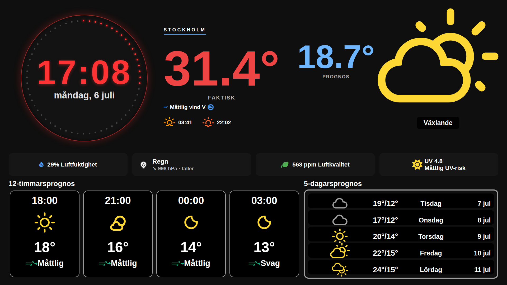

# 🌤️ Flask Weather Dashboard - Komplett Guide

**Version 3.0.0** · [Changelog](CHANGELOG.md)

**GitHub Repository:** [https://github.com/cgillinger/flask-weather](https://github.com/cgillinger/flask-weather)

En modern, responsiv väder-dashboard som fungerar på alla skärmstorlekar och enheter. Visar väderprognos från SMHI med valfri integration av Netatmo väderstation för faktiska mätningar. Inkluderar Weather Effects med animerade regn- och snöeffekter, UV-index från CAMS, och centraliserad färghantering för optimal visuell upplevelse.



## 🎯 Vad behöver jag?

### 📊 Scenario 1: Server + Surfplatta/Telefon

**🖥️ Server (kör dashboarden):**
- Raspberry Pi, Linux-dator eller Synology NAS
- Python 3.8+ och internetanslutning
- Ingen skärm eller webbläsare behövs

**📱 Klient (visar dashboarden):**
- iPad, Android-platta, telefon eller dator
- Modern webbläsare (Safari, Chrome, Firefox)
- WiFi-anslutning till samma nätverk

### 🖥️ Scenario 2: Allt-i-ett (Pi + skärm)

**📺 Dedikerad display:**
- Raspberry Pi 3B eller bättre (Pi5 rekommenderas för Weather Effects)
- 15.6" IPS-skärm (N156HCA-E5B optimerat @ 1920×1080, fungerar med andra storlekar)
- Chromium för kioskläge
- Tangentbord/mus för konfiguration

## ⚡ Snabbstart

### 🖥️ Server-installation (5 minuter)

**Linux/Ubuntu/Raspberry Pi:**
```bash
sudo apt update && sudo apt install python3 python3-pip git libeccodes-dev -y
cd ~ && git clone https://github.com/cgillinger/flask-weather.git && cd flask-weather
pip3 install -r requirements.txt --break-system-packages
cp reference/config_example.py reference/config.py
nano reference/config.py  # Konfigurera (se guide nedan)
python3 app.py
```

**Synology NAS:**
```bash
python3 -m pip install --user flask requests netCDF4 cdsapi
cd /var/services/homes/$(whoami) && git clone https://github.com/cgillinger/flask-weather.git && cd flask-weather
cp reference/config_example.py reference/config.py
nano reference/config.py
python3 app.py
```

**📱 Öppna sedan:** `http://SERVER-IP:8036` på din surfplatta/telefon

## 📋 Innehållsförteckning

- [Översikt](#-översikt)
- [Funktioner](#-funktioner)
- [Server-installation](#-server-installation)
- [Klient-setup](#-klient-setup)
- [Konfiguration](#-konfiguration)
- [Weather Effects](#-weather-effects)
- [UV-index](#-uv-index)
- [Färghantering](#-färghantering)
- [Användning](#-användning)
- [Anpassningar](#-anpassningar)
- [Felsökning](#-felsökning)
- [Support](#-support)

## 🎯 Översikt

Flask Weather Dashboard är en elegant väder-dashboard som kombinerar SMHI:s väderprognos med valfri integration av Netatmo väderstation. Systemet fungerar i **server/klient-arkitektur** - servern kan köras på vilken Linux-enhet som helst (Raspberry Pi, Synology NAS, Ubuntu-dator) medan dashboarden visas på surfplattor, telefoner eller dedikerade skärmar.

### 🌟 Två driftlägen:

**📊 SMHI-only (för användare utan Netatmo-utrustning)**
- ✅ Fungerar direkt utan extra konfiguration
- ✅ Visar väderprognos från SMHI
- ✅ Luftfuktighet från SMHI:s observationer
- ✅ Enkel trycktrend baserad på SMHI-data
- ✅ UV-index från CAMS (valfritt, kräver API-nyckel)

**🏠 SMHI + Netatmo (för användare med Netatmo-väderstation)**
- ✅ Allt från SMHI-only-läget PLUS:
- ✅ Faktisk temperatur från din Netatmo-väderstation
- ✅ CO2-mätning och luftkvalitet med färgkodning
- ✅ Avancerad trycktrend baserad på historiska data
- 🔧 Ljudnivå-mätning (backend-stöd finns, frontend ej aktiverat)

## ✨ Funktioner

### 🌡️ Väderdata
- **SMHI Väderprognos**: 12-timmars och 5-dagars prognoser med färgkodade temperaturer
- **Aktuell Temperatur**: Från SMHI eller Netatmo med färgkodning (frys → varmt)
- **Luftfuktighet**: SMHI observationer eller Netatmo
- **Lufttryck**: Femgradig trycktrend (faller snabbt · faller · stabilt · stiger · stiger snabbt) med färgkodade indikatorer och dubbelpil för snabb väderomställning. Valbart ordläge (`pressure_display: 'words'`) som visar beskrivande nivåord som en fysisk barometer.
- **Vinddata**: Beaufort-färgkodade vindikoner (grön → gul → orange → röd) med flera enhetsalternativ
- **Nederbörd**: Prognoser med regnintensitet
- **☀️ UV-index**: Real-time UV-data från CAMS med WHO/WMO-färgkodning (låg → extrem)

### 🎨 Visuella funktioner
- **Cirkulär klocka**: 60 LED-prickar som visar sekunder
- **Responsiv design**: Optimerad för alla skärmstorlekar (1920×1080 IPS primär målupplösning)
- **Teman**: Mörkt (produktionsklart) och ljust tema
- **Weather Icons**: Professionella väderikoner med dag/natt-varianter och färgkodning
- **Glassmorphism**: Modern glaseffektsdesign
- **🎨 ColorManager**: Centraliserad färghantering med 80+ CSS-variabler för konsistent färgpalett

### 🌈 Färghantering (ColorManager v1.0.0)
- **Centraliserad färgpalett**: Alla färger definieras en gång i `colors.css`
- **JavaScript API**: `ColorManager` tillhandahåller färger dynamiskt till alla komponenter
- **Noll duplicering**: Ingen hårdkodad färg i komponenterna
- **Temperatur-skala**: 5 nivåer från frys (blå) till varmt (orange)
- **UV-skala**: WHO/WMO-standard (grön → gul → orange → röd → lila)
- **Beaufort-skala**: Vindstyrka färgkodad (grön → gul → orange → röd)
- **Väderikon-färger**: Sol (guld), regn (cyan), snö (ljusblå), moln (grå), åska (gul)
- **Enkel temaändring**: Uppdatera `colors.css` för att ändra hela appens färgschema

### 🌦️ Weather Effects 
- **🌧️ Regn-animationer**: Realistiska regndroppar med vindpåverkan och färgkodning
- **❄️ Snö-effekter**: Fallande snöflingor med sparkle-effekter
- **⚡ SMHI-integration**: Automatiska effekter där SMHI vädersymboler bestämmer typ och nederbörd bestämmer intensitet
- **🎛️ Konfigurerbar intensitet**: Light, medium, heavy eller auto-detektering
- **🖥️ 1920×1080 IPS-optimerad**: 60fps animationer optimerade för N156HCA-E5B
- **🚀 GPU-acceleration**: Pi5-optimerad för smooth prestanda
- **🎚️ Anpassningsbar**: Konfigurerbart antal partiklar och hastigheter

### 🌅 Extra funktioner
- **Sol-tider**: Soluppgång/solnedgång med ipgeolocation API eller fallback-beräkning
- **Luftkvalitet**: CO2-mätning med färgkodning (endast med Netatmo)
- **Ljudnivå**: Decibel-mätning (backend-stöd finns, frontend ej aktiverat)
- **Auto-uppdatering**: Konfigurerbara uppdateringsintervall (standard: 30s)

## 🖥️ Server-installation

Servern kör Flask-applikationen och hanterar all väderdata. **Ingen skärm eller webbläsare behövs på servern.**

### 💻 Systemkrav för server

- **Linux-distribution** (Ubuntu, Debian, Raspberry Pi OS, Synology DSM)
- **Python 3.8+**
- **2GB+ RAM**
- **1GB lagringsutrymme**
- **Internetuppkoppling** för SMHI API, CAMS UV API (valfritt), ipgeolocation (valfritt)

### 🐧 Linux Server (Ubuntu/Debian/Pi OS)

#### Steg 1: Förbered systemet

```bash
sudo apt update && sudo apt upgrade -y
sudo apt install python3 python3-pip git curl nano libeccodes-dev -y
```
*Uppdaterar systemet och installerar grundläggande verktyg samt libeccodes för UV-funktionen.*

#### Steg 2: Ladda ner och installera

```bash
cd ~
git clone https://github.com/cgillinger/flask-weather.git
cd flask-weather
pip3 install -r requirements.txt --break-system-packages
```
*Laddar ner dashboarden och installerar alla Python-beroenden inklusive Flask, requests, netCDF4, cdsapi.*

#### Steg 3: Konfigurera

```bash
cp reference/config_example.py reference/config.py
nano reference/config.py
```

**Minimikonfiguration (fungerar direkt):**
```python
CONFIG = {
    'smhi': {
        'latitude': 59.3293,   # Stockholm (ändra till din koordinat)
        'longitude': 18.0686
    },
    'display': {
        'location_name': 'Stockholm'  # Visningsnamn
    }
}
```

**För UV-index (valfritt, kräver .cdsapirc setup):**

**VIKTIGT:** UV-funktionen kräver två steg:
1. **API-konto** på https://ads.atmosphere.copernicus.eu/
2. **~/.cdsapirc-fil** med dina credentials (se detaljerad guide i UV-index-sektionen)

I `config.py`:
```python
'cams_uv': {
    'enabled': True
}
```

**OBS:** API-nyckeln läggs INTE i config.py - den läses från ~/.cdsapirc automatiskt av cdsapi-biblioteket.

**För Netatmo (valfritt):**
Se [Konfiguration](#-konfiguration) för fullständig guide.

#### Steg 4: Testa och starta

```bash
python3 app.py
```
*Startar servern på port 8036. Servern är nu redo för klienter.*

**Förväntat output:**
```
 * Serving Flask app 'app'
 * Running on http://0.0.0.0:8036
✅ SMHI data loaded
✅ UV-index enabled (CAMS)
✅ ColorManager activated
```

#### Steg 5: Autostart (valfritt)

```bash
# Skapa systemd-service för autostart
sudo tee /etc/systemd/system/weather-dashboard.service > /dev/null <<EOF
[Unit]
Description=Weather Dashboard
After=network.target

[Service]
Type=simple
User=$USER
WorkingDirectory=$HOME/flask-weather
ExecStart=/usr/bin/python3 app.py
Restart=always

[Install]
WantedBy=multi-user.target
EOF

sudo systemctl enable weather-dashboard
sudo systemctl start weather-dashboard
```
*Konfigurerar automatisk start vid systemstart.*

### 🏢 Synology NAS Server

#### Steg 1: Förbered Synology

1. **DSM** → **Paketcenter** → Installera **Python 3**
2. **Kontrollpanel** → **Terminal & SNMP** → Aktivera **SSH-tjänst**
3. **Anslut via SSH:** `ssh admin@SYNOLOGY-IP`

#### Steg 2: Installera server

```bash
python3 -m pip install --user flask requests netCDF4 cdsapi
cd /var/services/homes/$(whoami)
git clone https://github.com/cgillinger/flask-weather.git
cd flask-weather
cp reference/config_example.py reference/config.py
nano reference/config.py
```
*Installerar Python-moduler och sätter upp projektet. **OBS:** libeccodes kan vara svårt att installera på Synology - UV-funktionen är valfri.*

#### Steg 3: Testa server

```bash
python3 app.py
```
*Startar servern. Testa genom att öppna `http://SYNOLOGY-IP:8036` på annan enhet.*

#### Steg 4: Autostart via DSM

1. **DSM** → **Kontrollpanel** → **Uppgiftsschema**
2. **Skapa** → **Användardefinierad script**
3. **Användare**: Ditt användarnamn
4. **Script:** 
   ```bash
   cd /var/services/homes/$(whoami)/flask-weather && python3 app.py
   ```
5. **Schema**: **När systemet startar**

### ✅ Server-installation klar

**Servern körs nu på:** `http://SERVER-IP:8036`

**Nästa steg:** [Klient-setup](#-klient-setup) för att visa dashboarden på surfplattor/skärmar.

## 📱 Klient-setup

Klienter visar dashboarden från servern. Fungerar på alla enheter med modern webbläsare.

### 📊 Klient-systemkrav

- **Modern webbläsare** (Safari, Chrome, Firefox, Edge)
- **WiFi-anslutning** till samma nätverk som servern
- **Minst 1024×768 upplösning** (optimerad för 1920×1080)

### 📱 iPad Webbapp-installation

**Perfekt för väggmonterad surfplatta eller köksvy!**

#### Steg för iPad:

1. **🌐 Öppna Safari** på iPad
2. **📍 Navigera** till `http://SERVER-IP:8036` (ersätt med din servers IP)
3. **📤 Tryck på delningsknappen** (kvadrat med uppåtpil)
4. **➕ Välj "Lägg till på hemskärmen"**
5. **✏️ Ändra namnet** till "Väder Dashboard"
6. **✅ Tryck "Lägg till"**

#### iPad-tips:
- **🔄 Landscape-orientering** ger bästa upplevelse
- **🔒 Inaktivera Auto-Lock:** Inställningar → Skärm och ljusstyrka → Auto-Lock → Aldrig
- **🎯 Guided Access:** För kioskfunktionalitet (Inställningar → Tillgänglighet → Guided Access)
- **⚡ Weather Effects** fungerar smidigt på iPad Pro och nyare modeller
- **🎨 ColorManager** ger optimal färgåtergivning på alla iPad-modeller

### 🤖 Android-platta Webbapp-installation

**Fungerar utmärkt på Samsung Galaxy Tab, Huawei, Lenovo och andra Android-plattor!**

#### Steg för Android (Chrome):

1. **🌐 Öppna Chrome** på Android-plattan
2. **📍 Navigera** till `http://SERVER-IP:8036`
3. **⋮ Tryck på menyn** (tre prickar, överst till höger)
4. **➕ Välj "Lägg till på startskärmen"** eller **"Installera app"**
5. **✏️ Ändra namnet** till "Väder Dashboard"
6. **✅ Tryck "Lägg till"**

#### Android-tips:
- **🔋 Inaktivera strömsparläge** för plattan när dashboarden körs
- **🌙 Nattläge:** Aktivera "Behåll skärmen på" under utvecklarinställningar
- **🎮 Kioskläge:** Använd appar som "Kiosk Browser Lockdown" för offentliga installationer
- **📱 Olika storlekar:** Fungerar på 7"-13" plattor, layout anpassas automatiskt

### 🖥️ Dedikerad display-installation (Pi + skärm)

**För permanenta väggmonterade displayer eller informationstavlor.**

#### Display-systemkrav:

- **Raspberry Pi 3B eller bättre** (Pi5 rekommenderas för Weather Effects)
- **15.6" IPS-skärm** (N156HCA-E5B @ 1920×1080 optimerat, fungerar med andra storlekar)
- **Chromium webbläsare** för kioskläge
- **4GB+ SD-kort**

#### Steg 1: Förbered Pi för display

```bash
sudo apt update && sudo apt upgrade -y
sudo apt install python3 python3-pip git curl nano chromium-browser xorg libeccodes-dev -y
```
*Installerar både server-komponenter OCH Chromium för display.*

#### Steg 2: Installera dashboard-server

```bash
cd ~
git clone https://github.com/cgillinger/flask-weather.git
cd flask-weather
pip3 install -r requirements.txt --break-system-packages
cp reference/config_example.py reference/config.py
nano reference/config.py
```
*Pi:n kör både server och klient lokalt.*

#### Steg 3: Konfigurera kioskläge

**Pi5 med Weather Effects (optimerat):**
```bash
chromium-browser --kiosk --disable-infobars --enable-gpu-rasterization --enable-zero-copy --disable-web-security http://localhost:8036
```

**Pi4 (balanserat läge):**
```bash
chromium-browser --kiosk --disable-infobars --enable-gpu-rasterization http://localhost:8036
```

**Pi3B (prestanda-optimerat):**
```bash
chromium-browser --kiosk --disable-infobars --memory-pressure-off --disable-dev-shm-usage http://localhost:8036
```

#### Steg 4: Autostart för display

```bash
# Skapa autostart-script
mkdir -p ~/.config/autostart
cat > ~/.config/autostart/weather-dashboard.desktop << 'EOF'
[Desktop Entry]
Type=Application
Name=Weather Dashboard
Exec=/bin/bash -c 'cd ~/flask-weather && python3 app.py & sleep 10 && chromium-browser --kiosk --disable-infobars http://localhost:8036'
Hidden=false
NoDisplay=false
X-GNOME-Autostart-enabled=true
EOF
```
*Startar både server och kiosk-display automatiskt.*

### 🔌 Hitta server-IP

**På server (Linux/Synology):**
```bash
ip addr show | grep 'inet 192' | awk '{print $2}' | cut -d'/' -f1
```
*Visar serverns IP-adress, t.ex. 192.168.1.100*

## ⚙️ Konfiguration

Huvudkonfigurationen görs i `reference/config.py`.

### 🔑 API-nycklar

**SMHI (obligatorisk, ingen nyckel krävs):**
```python
'smhi': {
    'latitude': 59.3293,   # Din koordinat
    'longitude': 18.0686,
    'enabled': True
}
```

**☀️ UV-index via CAMS (valfritt, kräver gratis API-nyckel):**
1. Registrera på https://ads.atmosphere.copernicus.eu/
2. Följ "How to use CDS API" för att få din API-nyckel
3. Konfigurera:
```python
'cams_uv': {
    'enabled': True,
    'api_key': 'DIN-UID:DIN-API-KEY',  # Format: "12345:abc123-..."
    'comment': 'Gratis från https://ads.atmosphere.copernicus.eu/'
}
```

**🏠 Netatmo (valfritt, kräver API-autentisering):**
```python
'netatmo': {
    'use_netatmo': True,
    'username': 'din@email.com',
    'password': 'ditt_lösenord',
    'client_id': 'DIN_CLIENT_ID',
    'client_secret': 'DIN_CLIENT_SECRET',
    'device_id': 'DIN_DEVICE_ID'
}
```

**🌅 Soltider via ipgeolocation (valfritt, fallback finns):**
```python
'ipgeolocation': {
    'api_key': 'DIN_API_KEY',  # Gratis från https://ipgeolocation.io/
    'comment': 'Om tom används förenklad solberäkning'
}
```

### 🎨 Display-inställningar

```python
'display': {
    'location_name': 'Stockholm',  # Ortnamn som visas
}

'ui': {
    'fullscreen': True,
    'refresh_interval_minutes': 15,
    'netatmo_refresh_interval_minutes': 10,
    'wind_unit': 'land',  # Alternativ: 'sjo', 'beaufort', 'ms', 'kmh'
    'theme': 'dark'  # Endast 'dark' är produktionsklar
}
```

### 🌦️ Weather Effects

**Standard-konfiguration (fungerar på de flesta enheter):**
```python
'weather_effects': {
    'enabled': True,
    'intensity': 'auto',  # Bestäms automatiskt från SMHI nederbörd
    'rain_config': {
        'droplet_count': 50,
        'min_speed': 15,
        'max_speed': 25
    },
    'snow_config': {
        'flake_count': 25,
        'min_speed': 2,
        'max_speed': 5
    }
}
```

## 🌦️ Weather Effects

Weather Effects skapar realistiska väderpanimationer synkroniserade med SMHI:s väderdata.

### 🎛️ Intensitetsnivåer

| Intensitet | Beskrivning | Användning |
|------------|-------------|------------|
| `'auto'` | Bestäms automatiskt från SMHI nederbörd | Mest realistisk (rekommenderat) |
| `'light'` | Lätta effekter med färre partiklar | Prestanda-sparläge |
| `'medium'` | Standard-intensitet | Balanserat läge |
| `'heavy'` | Intensiva effekter med många partiklar | Dramatisk effekt |

### 🌡️ SMHI Vädersymbol-mappning

| SMHI Symboler | Effekt | Beskrivning |
|---------------|--------|-------------|
| 1-7 | **Inget** | Klart väder |
| 8-10, 18-20 | **🌧️ Regn** | Regnskurar och regn |
| 11, 21 | **⚡ Åska** | Behandlas som intensivt regn |
| 12-14, 22-24 | **🌨️ Snöblandat** | Snö-effekter med regn-hastighet |
| 15-17, 25-27 | **❄️ Snö** | Snöbyar och snöfall |

### 🚀 Prestanda-optimering

**📱 Mobila enheter (iPad/Android):**
```python
'rain_config': {'droplet_count': 35},
'snow_config': {'flake_count': 20},
'lp156wh4_optimizations': {
    'gpu_acceleration': True,
    'target_fps': 45
}
```

**🖥️ Raspberry Pi 5:**
```python
'rain_config': {'droplet_count': 75},
'snow_config': {'flake_count': 40},
'lp156wh4_optimizations': {
    'gpu_acceleration': True,
    'target_fps': 60
}
```

## ☀️ UV-index

UV-index integration via CAMS (Copernicus Atmosphere Monitoring Service) ger real-time UV-data.

### 📊 WHO/WMO Färgkodning

| UV-värde | Risk-nivå | Färg | Rekommendation |
|----------|-----------|------|----------------|
| 0-2 | **Låg** | 🟢 Grön | Ingen särskild åtgärd |
| 3-5 | **Måttlig** | 🟡 Gul | Solskydd rekommenderas |
| 6-7 | **Hög** | 🟠 Orange | Solskydd krävs |
| 8-10 | **Mycket hög** | 🔴 Röd | Extra försiktighet |
| 11+ | **Extrem** | 🟣 Lila | Undvik exponering |

### ⚙️ Konfiguration

**Aktivera UV-index:**
```python
'cams_uv': {
    'enabled': True,
    'api_key': 'DIN-UID:DIN-API-KEY',
    'max_cache_hours': 6,  # Cachar data i 6 timmar
    'comment': 'Gratis API från https://ads.atmosphere.copernicus.eu/'
}
```

**API-nyckel setup (detaljerad guide):**

1. **Registrera konto:**
   - Gå till https://ads.atmosphere.copernicus.eu/
   - Klicka "Register" och skapa gratis konto
   - Bekräfta din email

2. **Acceptera licens:**
   - Logga in på https://ads.atmosphere.copernicus.eu/
   - Gå till https://ads.atmosphere.copernicus.eu/datasets/cams-global-atmospheric-composition-forecasts
   - Klicka "Download data" och acceptera "Terms of Use"
   - **VIKTIGT:** Utan denna accept fungerar inte API:et!

3. **Hämta API-nyckel:**
   - Gå till https://ads.atmosphere.copernicus.eu/how-to-api
   - Din UID och API-key visas på sidan
   - Format: `UID: 12345` och `API-KEY: abc123-def456-...`

4. **Skapa ~/.cdsapirc-fil:**
   ```bash
   # Skapa filen (Linux/Pi)
   nano ~/.cdsapirc
   
   # Lägg in följande (ersätt med DINA värden):
   url: https://ads.atmosphere.copernicus.eu/api
   key: 12345:abc123-def456-ghi789
   
   # Spara (Ctrl+O, Enter, Ctrl+X)
   
   # Sätt rätt behörigheter
   chmod 600 ~/.cdsapirc
   ```
   
   **Format för key:** `UID:API-KEY` (kolon mellan, inget mellanslag)
   
   **Exempel:**
   ```
   url: https://ads.atmosphere.copernicus.eu/api
   key: 12345:abc123-def456-ghi789-jkl012-mno345
   ```

5. **Testa konfigurationen:**
   ```bash
   # Verifiera att filen finns
   cat ~/.cdsapirc
   
   # Testa Python-klienten
   python3 -c "import cdsapi; c = cdsapi.Client(); print('✅ CAMS API OK')"
   ```

**Vanliga fel:**
- **"Invalid API key"** → Kontrollera UID:API-KEY format (kolon, inga mellanslag)
- **"License not accepted"** → Gå till dataset-sidan och acceptera Terms of Use
- **"~/.cdsapirc not found"** → Filen måste vara i hemkatalogen (~/ betyder /home/användare/)

### 🔍 Felsökning UV-index

**Kontrollera UV-status:**
```bash
curl http://SERVER-IP:8036/api/uv
```

**Förväntat svar:**
```json
{
  "uv_index": 0.2,
  "uv_level": "low",
  "risk_text": "Låg UV-risk",
  "source": "cams",
  "timestamp": "2025-01-10T16:00:00Z"
}
```

**Vanliga problem:**
- **"UV-data saknas"** → Kontrollera API-nyckel och libeccodes-installation
- **"Invalid API key"** → Verifiera UID:API-KEY format
- **"License not accepted"** → Acceptera CAMS-licensen i ditt konto

## 🎨 Färghantering

ColorManager v1.0.0 tillhandahåller centraliserad färghantering för hela applikationen.

### 🌈 Färgkategorier

**1. Temperatur-skala (5 nivåer):**
- **Freezing** (< 0°C): 🔵 Blå (#3b82f6)
- **Cold** (0-10°C): 🟦 Ljusblå (#06b6d4)
- **Cool** (10-20°C): 🟡 Gul (#f59e0b)
- **Warm** (20-30°C): 🟠 Orange (#fb923c)
- **Hot** (> 30°C): 🔴 Röd (#ef4444)

**2. UV-skala (WHO/WMO standard):**
- **Low** (0-2): 🟢 Grön (#4CAF50)
- **Moderate** (3-5): 🟡 Gul (#FDD835)
- **High** (6-7): 🟠 Orange (#FB8C00)
- **Very High** (8-10): 🔴 Röd (#E53935)
- **Extreme** (11+): 🟣 Lila (#8E24AA)

**3. Beaufort-skala för vind:**
- **Calm** (0-3): 🟢 Grön (#10b981)
- **Moderate** (4-6): 🟡 Gul (#f59e0b)
- **Strong** (7-9): 🟠 Orange (#fb923c)
- **Storm** (10-12): 🔴 Röd (#ef4444)

**4. Väderikon-färger:**
- **Sol**: 🟡 Guld (#FFD700)
- **Halvklart**: 🟠 Orange (#FFA500)
- **Moln**: ⚪ Grå (#90A4AE)
- **Regn**: 🔵 Cyan (#4fc3f7)
- **Snö**: 🔵 Ljusblå (#81d4fa)
- **Åska**: 🟡 Gul (#ffd54f)

### 📁 Arkitektur

```
colors.css (v1.0.0)
    ↓ @import
styles.css (v2.1.0) → Layout/struktur
    ↓ CSS-variabler
color-manager.js (v1.0.0) → JavaScript API
    ↓ Dynamisk färgkodning
Komponenter (forecast-view.js, current-weather-view.js, etc)
```

### 🔧 API-användning

**JavaScript:**
```javascript
// Hämta färg för temperatur
const color = ColorManager.getTemperatureColor(25);  // "#fb923c" (orange)

// Hämta färg för vindstyrka
const windColor = ColorManager.getWindColor(8.5);  // "#f59e0b" (gul, Beaufort 5)

// Hämta färg för UV-index
const uvColor = ColorManager.getUVColor('high');  // "#FB8C00" (orange)

// Hämta färg för väderikon
const iconColor = ColorManager.getWeatherIconColor(1);  // "#FFD700" (guld-sol)
```

### 🎨 Anpassa färgschema

Redigera `static/css/colors.css`:
```css
:root {
    /* Temperatur-färger */
    --temp-freezing: #3b82f6;   /* Ändra till din blå-nyans */
    --temp-cold: #06b6d4;
    --temp-cool: #f59e0b;
    --temp-warm: #fb923c;
    --temp-hot: #ef4444;
    
    /* Väderikon-färger */
    --weather-sun: #FFD700;
    --weather-rain: #4fc3f7;
    /* ... etc */
}
```

**Alla komponenter uppdateras automatiskt!** 🎉

## 🚀 Användning

### 🖥️ Starta server

**Linux/Pi:**
```bash
cd ~/flask-weather
python3 app.py
```

**Synology:**
```bash
cd /var/services/homes/$(whoami)/flask-weather
python3 app.py
```

### 📱 Öppna på klienter

- **📍 Server-adress**: `http://SERVER-IP:8036`
- **🔍 Hitta IP**: Kör `ip addr` på servern
- **🏠 Lokalt (Pi+skärm)**: `http://localhost:8036`

### 🔧 API-endpoints

**Aktuell väderdata:**
```bash
curl http://SERVER-IP:8036/api/current
```

**UV-index:**
```bash
curl http://SERVER-IP:8036/api/uv
```

**Weather Effects-konfiguration:**
```bash
curl http://SERVER-IP:8036/api/weather-effects-config
```

**ColorManager status:**
```bash
# Testa i webbläsarens konsol (F12)
console.log(ColorManager.getTemperatureColor(25));
```

**Systemstatus:**
```bash
curl http://SERVER-IP:8036/api/status
```

**Trycktrend-data:**
```bash
curl http://SERVER-IP:8036/api/pressure_trend
```

## 🎛️ Anpassningar

### 🎨 Ändra färgschema

Redigera `static/css/colors.css` för att ändra hela appens färgpalett:

```css
:root {
    --temp-freezing: #YourColor;
    --weather-sun: #YourColor;
    /* etc... */
}
```

### ⏱️ Ändra uppdateringsintervall

```python
'ui': {
    'refresh_interval_minutes': 15,  # SMHI-data (5-60 minuter)
    'netatmo_refresh_interval_minutes': 10,  # Netatmo (5-30 minuter)
}
```

### 💨 Ändra vindenheter

```python
'ui': {
    'wind_unit': 'land',  # Alternativ: 'sjo', 'beaufort', 'ms', 'kmh'
}
```

**Vindenheter:**
- **'land'**: Svensk landterminologi (Frisk bris, Måttlig vind, etc)
- **'sjo'**: Svensk sjöterminologi (Styv kuling, Storm, etc)
- **'beaufort'**: Beaufort-skala (Beaufort 5, Beaufort 8, etc)
- **'ms'**: Meter per sekund (8.5 m/s)
- **'kmh'**: Kilometer per timme (30 km/h)

### 🌦️ Anpassa Weather Effects

```python
'weather_effects': {
    'enabled': True,
    'intensity': 'auto',  # eller 'light', 'medium', 'heavy'
    'rain_config': {
        'droplet_count': 75,
        'wind_direction': 'left-to-right'
    }
}
```

### 🔌 Ändra port

Redigera `app.py` längst ner:

```python
app.run(
    host='0.0.0.0',
    port=8036,  # Ändra till önskad port
    debug=False,
    threaded=True
)
```

## 🛠️ Felsökning

### 🔍 Vanliga problem

#### 🚫 Server startar inte

**Systemkontroll:**
```bash
python3 --version  # Kräver 3.8+
python3 -c "import flask, requests, netCDF4, cdsapi; print('✅ Moduler OK')"
python3 -c "from reference.config import CONFIG; print('✅ Config OK')"
```

**libeccodes-problem (UV-funktionen):**
```bash
sudo apt install libeccodes-dev
pip3 install netCDF4 cdsapi --break-system-packages --force-reinstall
```

#### 🌐 Klient kan inte ansluta

```bash
# På server
ip addr show | grep 'inet 192'
netstat -tulpn | grep :8036

# På klient  
ping SERVER-IP
curl http://SERVER-IP:8036/api/status
```

#### ☀️ UV-index visas inte

**Diagnostik:**
```bash
curl http://SERVER-IP:8036/api/uv
python3 -c "from reference.config import CONFIG; print('UV enabled:', CONFIG.get('cams_uv', {}).get('enabled'))"
```

**Lösningar:**
1. Verifiera API-nyckel i config.py
2. Kontrollera libeccodes: `ldconfig -p | grep eccodes`
3. Acceptera CAMS-licens på https://ads.atmosphere.copernicus.eu/

#### 🎨 ColorManager fungerar inte

**Webbläsarkonsol (F12):**
```javascript
// Kontrollera att ColorManager finns
console.log(typeof ColorManager);  // Ska vara "object"

// Testa färgmetoder
console.log(ColorManager.getTemperatureColor(20));  // Ska ge färgkod
```

**Lösning:**
1. Verifiera att `color-manager.js` laddas i `templates/index.html`
2. Kontrollera att `colors.css` importeras i `styles.css`
3. Hard refresh: Ctrl+Shift+R

#### 📱 Weather Effects fungerar inte

```bash
curl -s http://SERVER-IP:8036/api/weather-effects-config | grep enabled
```

#### 🐌 Prestanda-problem

**Mobila enheter - reducera partiklar:**
```python
'rain_config': {'droplet_count': 25}
'snow_config': {'flake_count': 15}
```

**Pi - GPU-minne:**
```bash
echo "gpu_mem=128" | sudo tee -a /boot/config.txt
sudo reboot
```

### 📊 Komplett systemkontroll

```bash
echo "=== Weather Dashboard Systemkontroll ==="
echo "Python: $(python3 --version)"
echo "Flask: $(python3 -c 'import flask; print(flask.__version__)' 2>/dev/null || echo 'SAKNAS')"
echo "netCDF4: $(python3 -c 'import netCDF4; print(netCDF4.__version__)' 2>/dev/null || echo 'SAKNAS')"
echo "SMHI: $(curl -s --max-time 5 https://api.smhi.se > /dev/null && echo 'OK' || echo 'PROBLEM')"
echo "Config: $(python3 -c 'from reference.config import CONFIG; print("OK")' 2>/dev/null || echo 'PROBLEM')"
echo "Weather Effects: $(python3 -c 'from reference.config import CONFIG; print("ON" if CONFIG.get("weather_effects", {}).get("enabled") else "OFF")' 2>/dev/null || echo 'ERROR')"
echo "UV-index: $(python3 -c 'from reference.config import CONFIG; print("ON" if CONFIG.get("cams_uv", {}).get("enabled") else "OFF")' 2>/dev/null || echo 'ERROR')"
echo "Port 8036: $(netstat -tuln | grep :8036 > /dev/null && echo 'UPPTAGEN' || echo 'LEDIG')"
```

## 🔧 Support

### 📚 Resurser

- **GitHub Issues**: [https://github.com/cgillinger/flask-weather/issues](https://github.com/cgillinger/flask-weather/issues)
- **Konfiguration**: `reference/config_example.py` har detaljerade kommentarer
- **API-dokumentation**: Tillgänglig via `/api/`-endpoints

### 🆙 Uppdateringar

**Backup och uppdatera:**
```bash
cd ~/flask-weather
cp reference/config.py reference/config.backup
git pull
pip3 install -r requirements.txt --break-system-packages --upgrade
cp reference/config.backup reference/config.py
python3 app.py
```

### 🔄 Återställning

```bash
# Skapa backup
mkdir -p backup/$(date +%Y%m%d_%H%M%S)
cp reference/config.py backup/$(date +%Y%m%d_%H%M%S)/

# Återställ från backup
cp backup/DATUM_TID/config.py reference/
```

---

## 📄 Licens

Detta projekt är open source under MIT-licens. Se LICENSE-filen för detaljer.

## 🙏 Tack till

- **SMHI**: För öppet väder-API
- **CAMS/Copernicus**: För UV-index data
- **Netatmo**: För väderstation-API
- **Weather Icons**: För professionella väderikoner (Erik Flowers)
- **Flask**: För robust webbramverk
- **MagicMirror Community**: För inspiration till Weather Effects

---

## 📊 Teknisk översikt

### 🏗️ Arkitektur

**Backend (Python/Flask):**
- `app.py`: Flask-server och routing
- `reference/data/smhi_client.py`: SMHI API-klient
- `reference/data/netatmo_client.py`: Netatmo API-klient
- `reference/data/cams_uv_client.py`: CAMS UV API-klient
- `reference/data/utils.py`: Hjälpfunktioner och solberäkningar

**Frontend (HTML/CSS/JavaScript):**
- `templates/index.html`: Huvudtemplate
- `static/css/colors.css`: Centraliserad färgpalett (80+ variabler)
- `static/css/styles.css`: Huvudlayout och design
- `static/css/weather-effects.css`: Weather Effects CSS
- `static/js/utils/color-manager.js`: JavaScript API för färghantering
- `static/js/dashboard-views/`: View-komponenter (current-weather, forecast)
- `static/js/dashboard-components/`: UI-komponenter (clock, barometer, UV-display)
- `static/js/weather-effects.js`: Weather Effects-motor

### 📦 Dependencies

**Python:**
- Flask (webbserver)
- requests (HTTP-requests)
- netCDF4 (UV-data parsing)
- cdsapi (CAMS API-klient)

**JavaScript:**
- Vanilla JS (inga ramverk)
- Weather Icons (väderikoner)
- FontAwesome (UI-ikoner)

### 🌐 API-endpoints

| Endpoint | Beskrivning | Exempel |
|----------|-------------|---------|
| `/` | Huvudsida | `http://SERVER-IP:8036/` |
| `/api/current` | Aktuell väderdata | JSON med SMHI + Netatmo |
| `/api/uv` | UV-index | JSON med CAMS UV-data |
| `/api/forecast` | Timprognos | 12h SMHI-prognos |
| `/api/daily_forecast` | Dagsprognos | 5-dagars SMHI-prognos |
| `/api/weather-effects-config` | Weather Effects status | JSON med konfiguration |
| `/api/pressure_trend` | Trycktrend | Historisk tryckdata |
| `/api/status` | Systemstatus | Hälsokontroll |

### 🎨 Färgsystem (ColorManager v1.0.0)

**Komponenter:**
1. **colors.css**: CSS-variabler för alla färger
2. **color-manager.js**: JavaScript API
3. **Komponenter**: Använder ColorManager för dynamisk färgsättning

**Fördelar:**
- ✅ Centraliserad färghantering (ändra en gång → uppdatera allt)
- ✅ Noll duplicering av färgdefinitioner
- ✅ Dynamisk färgkodning baserad på data
- ✅ Tematisk konsistens över hela appen
- ✅ Enkel anpassning för olika skärmtyper

---

**🌤️ Lycka till med din väder-dashboard!**

**📱 Perfekt för surfplattor, dedikerade displayer och kioskinstallationer!**

**🎨 Nu med ColorManager för professionell färghantering!**

**☀️ UV-index för säkrare soldagar!**
