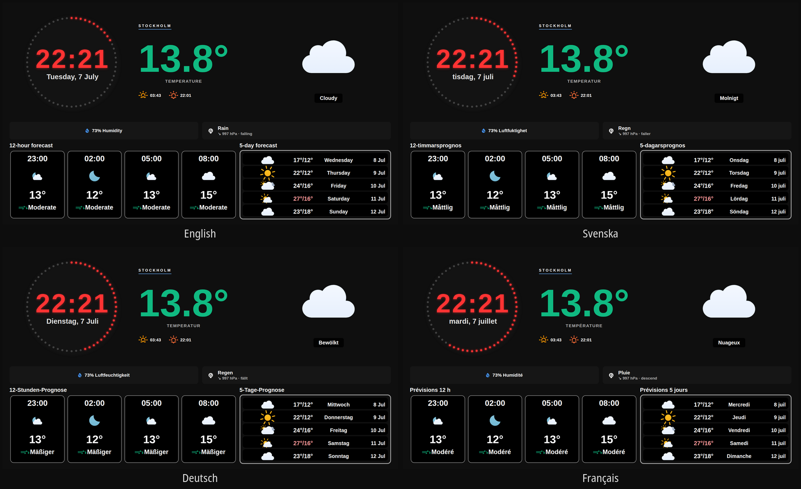
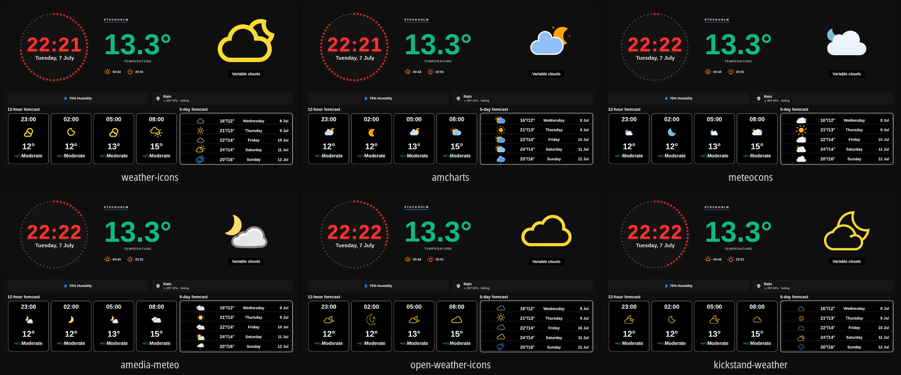

# 🌤️ Flask Weather Dashboard

**A self-hosted weather display for Raspberry Pi, Synology NAS or any Linux box — with your choice of forecast provider and first-class Netatmo weather-station support.** Designed for wall-mounted tablets, kiosk screens and old iPads given a second life.

[](LICENSE)
[](https://www.python.org/)
[](https://flask.palletsprojects.com/)
[](#-server-installation)
[](#-weather-data)
[](#-configuration)
[](#-languages)
[](CHANGELOG.md)

🌐 **English** · [Svenska](readme.sv.md) · [Norsk](readme.nb.md) · [Dansk](readme.da.md) · [Suomi](readme.fi.md) · [Deutsch](readme.de.md) · [Français](readme.fr.md) · [Español](readme.es.md)

> 🧑‍🔧 **This is a personal hobby project, shared as-is.** I mostly built it for the weather screen on my own wall. I'm putting it on GitHub in case someone else wants a clean, good-looking weather display — especially one with real **Netatmo** support — but I may not have time to answer bug reports or review pull requests. You're very welcome to fork it and make it your own. See [Support & contributing](#-support--contributing) for the friendly details.


*Live from my own wall display: the **measured** temperature, humidity, pressure and CO₂ from a Netatmo station (green, “FAKTISK”) shown right next to the **forecast** (blue, “PROGNOS”), with UV index and a five-day outlook.*

## 💡 What is this?

A small Flask web app that turns any spare screen into an elegant, always-on weather dashboard. One low-power device (a Raspberry Pi, a Synology NAS, or any Linux machine) runs the server; any tablet, phone or dedicated monitor displays it in a browser. It works out of the box with just a location, and grows with you if you own a Netatmo weather station.

**Why you might want it:**

- 🌍 **Pick your forecast source** — SMHI (Nordics), or **YR/met.no** and **Open-Meteo** for **global coverage**. No API key required, and every provider is normalised to the same icons and animations.
- 🏠 **Real measurements, not just forecasts** — with a **Netatmo** weather station you see your *actual* temperature, humidity, air pressure and indoor **CO₂/air quality** beside the forecast. This is the feature most weather dashboards don't have.
- 🎨 **Looks the part** — a glassmorphism dark theme, a circular LED clock, colour-coded temperatures/wind/UV, **six swappable icon packs** and animated **rain & snow effects** that follow the real forecast.
- 🌐 **Speaks your language** — eight UI languages with wind terminology taken from each country's national weather service.
- 📟 **Built for kiosks** — tuned for 1920×1080 wall panels and iPad/Android home-screen web apps, with performance options for Raspberry Pi and Safari/WebKit.

Everything is configured in one commented `config.py` file — no database, no build step, no account required for the basics.

## 🖼️ Gallery

**Eight UI languages** (wind terms, weekdays, barometer words and compass letters all localise):



**Six swappable icon packs** (same dashboard, different weather icons — set `ui.icon_pack`, or let them rotate automatically):



## 🎯 What do I need?

### 📊 Scenario 1: Server + Tablet/Phone

**🖥️ Server (runs the dashboard):**
- Raspberry Pi, Linux computer or Synology NAS
- Python 3.8+ and an internet connection
- No screen or browser needed

**📱 Client (displays the dashboard):**
- iPad, Android tablet, phone or computer
- Modern browser (Safari, Chrome, Firefox)
- WiFi connection to the same network

### 🖥️ Scenario 2: All-in-one (Pi + screen)

**📺 Dedicated display:**
- Raspberry Pi 3B or better (Pi5 recommended for Weather Effects)
- 15.6" IPS screen (optimized for N156HCA-E5B @ 1920×1080, works with other sizes)
- Chromium for kiosk mode
- Keyboard/mouse for configuration

## ⚡ Quick start

### 🖥️ Server installation (5 minutes)

**Linux/Ubuntu/Raspberry Pi:**
```bash
sudo apt update && sudo apt install python3 python3-pip git libeccodes-dev -y
cd ~ && git clone https://github.com/cgillinger/flask-weather.git && cd flask-weather
pip3 install -r requirements.txt --break-system-packages
cp reference/config_example.py reference/config.py
nano reference/config.py  # Configure (see guide below)
python3 app.py
```

**Synology NAS:**
```bash
python3 -m pip install --user flask requests netCDF4 cdsapi
cd /var/services/homes/$(whoami) && git clone https://github.com/cgillinger/flask-weather.git && cd flask-weather
cp reference/config_example.py reference/config.py
nano reference/config.py
python3 app.py
```

**📱 Then open:** `http://SERVER-IP:8036` on your tablet/phone

## 📋 Table of contents

- [Overview](#-overview)
- [Features](#-features)
- [Server installation](#-server-installation)
- [Client setup](#-client-setup)
- [Configuration](#-configuration)
- [Weather Effects](#-weather-effects)
- [UV index](#-uv-index)
- [Color management](#-color-management)
- [Usage](#-usage)
- [Customization](#-customization)
- [Troubleshooting](#-troubleshooting)
- [Support](#-support)

## 🎯 Overview

Flask Weather Dashboard is an elegant weather dashboard that combines a national weather institute forecast with optional integration of a Netatmo weather station. The system uses a **server/client architecture** - the server can run on any Linux device (Raspberry Pi, Synology NAS, Ubuntu computer) while the dashboard is displayed on tablets, phones or dedicated screens.

### 🌟 Two operating modes:

**📊 Forecast-only (for users without Netatmo equipment)**
- ✅ Works immediately without extra configuration
- ✅ Shows the weather forecast from the selected provider
- ✅ Humidity from SMHI observations or the provider forecast
- ✅ Simple pressure trend based on forecast data
- ✅ UV index from CAMS (optional, requires API key)

**🏠 Forecast + Netatmo (for users with a Netatmo weather station)**
- ✅ Everything from forecast-only mode PLUS:
- ✅ Actual temperature from your Netatmo weather station
- ✅ CO2 measurement and air quality with color coding
- ✅ Advanced pressure trend based on historical data
- 🔧 Noise level measurement (backend support exists, frontend not enabled)

## ✨ Features

### 🌡️ Weather data
- **Selectable weather provider** (`weather_provider`): SMHI (default), YR/met.no or Open-Meteo — 12-hour and 5-day forecasts with color-coded temperatures. All providers are normalized to SMHI's symbol scale so icons and effects work identically; YR and Open-Meteo have **global coverage** (SMHI only covers the Nordics)
- **Current temperature**: From the selected provider or Netatmo, with color coding (freezing → hot)
- **Humidity**: SMHI observations, provider forecast (YR/Open-Meteo) or Netatmo
- **Air pressure**: Five-step pressure trend (falling fast · falling · steady · rising · rising fast) with color-coded indicators and a double arrow for rapid weather changes. Optional word mode (`pressure_display: 'words'`) that shows descriptive level words like a physical barometer.
- **Wind data**: Beaufort color-coded wind icons (green → yellow → orange → red) with several unit options
- **Precipitation**: Forecasts with rain intensity
- **☀️ UV index**: Real-time UV data from CAMS with WHO/WMO color coding (low → extreme)

### 🌐 Languages
- **Eight UI languages** (`ui.language`): Swedish, Norwegian, Danish, Finnish, German, French, Spanish and English — wind terminology per language follows each country's weather institute (SMHI/YR/DMI/FMI/DWD/Météo-France/AEMET/Met Office)

### 🎨 Visual features
- **Circular clock**: 60 LED dots showing seconds
- **Responsive design**: Optimized for all screen sizes (1920×1080 IPS is the primary target resolution)
- **Themes**: Dark (production-ready) and light theme
- **Six icon packs** with optional automatic rotation (day/week/month)
- **Glassmorphism**: Modern glass-effect design
- **🎨 ColorManager**: Centralized color management with 80+ CSS variables

### 🌦️ Weather Effects
- **🌧️ Rain animations**: Realistic raindrops with wind influence and color coding
- **❄️ Snow effects**: Falling snowflakes with sparkle effects
- **⚡ Symbol-driven**: Weather symbols decide the effect type, precipitation decides intensity — fully language- and provider-independent
- **🎛️ Configurable intensity**: Light, medium, heavy or auto detection
- **🚀 GPU acceleration**: Pi5-optimized for smooth performance

### 🌅 Extras
- **Sun times**: Sunrise/sunset via the ipgeolocation API or fallback calculation
- **Air quality**: CO2 measurement with color coding (Netatmo only; the tile is hidden in forecast-only mode)
- **Auto refresh**: Configurable update intervals

## 🖥️ Server installation

The server runs the Flask application and handles all weather data. **No screen or browser is needed on the server.**

### 💻 Server system requirements

- **Linux distribution** (Ubuntu, Debian, Raspberry Pi OS, Synology DSM)
- **Python 3.8+**
- **2GB+ RAM**, **1GB storage**
- **Internet connection** for the weather API, CAMS UV API (optional), ipgeolocation (optional)

### 🐧 Linux server (Ubuntu/Debian/Pi OS)

#### Step 1: Prepare the system

```bash
sudo apt update && sudo apt upgrade -y
sudo apt install python3 python3-pip git curl nano libeccodes-dev -y
```
*Updates the system and installs base tooling plus libeccodes for the UV feature.*

#### Step 2: Download and install

```bash
cd ~
git clone https://github.com/cgillinger/flask-weather.git
cd flask-weather
pip3 install -r requirements.txt --break-system-packages
```

#### Step 3: Configure

```bash
cp reference/config_example.py reference/config.py
nano reference/config.py
```

**Minimal configuration (works out of the box):**
```python
CONFIG = {
    'smhi': {
        'latitude': 59.3293,   # Stockholm (change to your coordinates)
        'longitude': 18.0686
    },
    'display': {
        'location_name': 'Stockholm'  # Display name
    }
}
```

**Weather provider:**
```python
'weather_provider': 'yr',  # 'yr' (default, global) | 'smhi' (Nordics only) | 'open-meteo' (global)
```
The shipped example config defaults to **YR/met.no** (global coverage), **English UI** and **forecast-only mode** (no Netatmo).
The coordinates in the `smhi` block are used regardless of provider — with `yr` (met.no) or `open-meteo` the dashboard works **anywhere in the world**. No provider requires an API key; humidity then comes from the forecast instead of SMHI's observation stations, and the provider's symbol codes (YR symbol_code or WMO codes) are automatically translated to the SMHI 1-27 scale, so icon packs and weather effects work identically.

**UV index (optional, requires .cdsapirc setup):**

**IMPORTANT:** The UV feature requires two steps:
1. **API account** at https://ads.atmosphere.copernicus.eu/
2. **~/.cdsapirc file** with your credentials (see the detailed guide in the UV index section)

In `config.py`:
```python
'cams_uv': {
    'enabled': True
}
```

**NOTE:** The API key does NOT go into config.py - it is read from ~/.cdsapirc automatically by the cdsapi library.

**Netatmo (optional):**
See [Configuration](#-configuration).

#### Step 4: Test and start

```bash
python3 app.py
```
*Starts the server on port 8036.*

#### Step 5: Autostart (optional)

```bash
sudo tee /etc/systemd/system/weather-dashboard.service > /dev/null <<EOF
[Unit]
Description=Weather Dashboard
After=network.target

[Service]
Type=simple
User=$USER
WorkingDirectory=$HOME/flask-weather
ExecStart=/usr/bin/python3 app.py
Restart=always

[Install]
WantedBy=multi-user.target
EOF

sudo systemctl enable weather-dashboard
sudo systemctl start weather-dashboard
```

### 🏢 Synology NAS server

#### Step 1: Prepare Synology

1. **DSM** → **Package Center** → Install **Python 3**
2. **Control Panel** → **Terminal & SNMP** → Enable **SSH service**
3. **Connect via SSH:** `ssh admin@SYNOLOGY-IP`

#### Step 2: Install the server

```bash
python3 -m pip install --user flask requests netCDF4 cdsapi
cd /var/services/homes/$(whoami)
git clone https://github.com/cgillinger/flask-weather.git
cd flask-weather
cp reference/config_example.py reference/config.py
nano reference/config.py
```
*Note: libeccodes can be hard to install on Synology - the UV feature is optional.*

#### Step 3: Test the server

```bash
python3 app.py
```
*Open `http://SYNOLOGY-IP:8036` on another device to verify.*

#### Step 4: Autostart via DSM

1. **DSM** → **Control Panel** → **Task Scheduler**
2. **Create** → **User-defined script**
3. **User**: your username
4. **Script:**
   ```bash
   cd /var/services/homes/$(whoami)/flask-weather && python3 app.py
   ```
5. **Schedule**: **On boot**

### ✅ Server installation done

**The server now runs at:** `http://SERVER-IP:8036`

## 📱 Client setup

Clients display the dashboard from the server. Works on any device with a modern browser.

### 📱 iPad web app installation

1. **🌐 Open Safari** on the iPad
2. **📍 Navigate** to `http://SERVER-IP:8036`
3. **📤 Tap the share button**
4. **➕ Choose "Add to Home Screen"**
5. **✅ Tap "Add"**

**iPad tips:**
- **🔄 Landscape orientation** gives the best experience
- **🔒 Disable Auto-Lock:** Settings → Display & Brightness → Auto-Lock → Never
- **🎯 Guided Access** for kiosk behavior (Settings → Accessibility → Guided Access)
- **⚡ Weather Effects** run smoothly on iPad Pro and newer; animated SVG icon packs are automatically limited to the hero icon on iPad (see `icon_animations`)

### 🤖 Android tablet web app installation

1. **🌐 Open Chrome**
2. **📍 Navigate** to `http://SERVER-IP:8036`
3. **⋮ Open the menu** → **"Add to Home screen"** / **"Install app"**

**Android tips:**
- **🔋 Disable battery saver** while the dashboard is running
- **🎮 Kiosk mode:** use apps like "Kiosk Browser Lockdown" for public installs

### 🖥️ Dedicated display (Pi + screen)

```bash
sudo apt update && sudo apt upgrade -y
sudo apt install python3 python3-pip git curl nano chromium-browser xorg libeccodes-dev -y
cd ~
git clone https://github.com/cgillinger/flask-weather.git
cd flask-weather
pip3 install -r requirements.txt --break-system-packages
cp reference/config_example.py reference/config.py
```

**Kiosk mode (Pi5, optimized for Weather Effects):**
```bash
chromium-browser --kiosk --disable-infobars --enable-gpu-rasterization --enable-zero-copy http://localhost:8036
```

**Autostart:**
```bash
mkdir -p ~/.config/autostart
cat > ~/.config/autostart/weather-dashboard.desktop << 'EOF'
[Desktop Entry]
Type=Application
Name=Weather Dashboard
Exec=/bin/bash -c 'cd ~/flask-weather && python3 app.py & sleep 10 && chromium-browser --kiosk --disable-infobars http://localhost:8036'
Hidden=false
NoDisplay=false
X-GNOME-Autostart-enabled=true
EOF
```

### 🔌 Find the server IP

```bash
ip addr show | grep 'inet 192' | awk '{print $2}' | cut -d'/' -f1
```

## ⚙️ Configuration

The main configuration lives in `reference/config.py`.

### 🔑 API keys

**Weather provider (mandatory, no key required):**
```python
'weather_provider': 'yr',  # 'yr' | 'smhi' | 'open-meteo'
'smhi': {
    'latitude': 59.3293,   # Your coordinates (used by all providers)
    'longitude': 18.0686
}
```

**☀️ UV index via CAMS (optional, free API key):** see the [UV index](#-uv-index) section.

**🏠 Netatmo (optional):** requires client_id/client_secret/refresh_token from https://dev.netatmo.com/apps — see `reference/config_example.py` for details.

**🌅 Sun times via ipgeolocation (optional, fallback exists):**
```python
'ipgeolocation': {
    'api_key': 'YOUR_API_KEY',  # Free from https://ipgeolocation.io/
}
```

### 🎨 Display settings

```python
'display': {
    'location_name': 'Stockholm',  # Location label shown on screen
}

'ui': {
    'fullscreen': True,
    'refresh_interval_minutes': 15,
    'netatmo_refresh_interval_minutes': 10,
    'wind_unit': 'land',  # Options: 'sjo', 'beaufort', 'ms', 'kmh'
    'pressure_display': 'words',  # 'words' = barometer words, 'numeric' = numbers
    'icon_pack': 'weather-icons',  # Weather icon set, see below
    'icon_animations': 'auto',  # Icon animation mode for SVG packs, see below
    'icon_pack_rotation': {  # Automatic pack rotation, see below
        'enabled': False,
        'interval': 'week',  # 'day' | 'week' | 'month'
        'exclude': [],
    },
    'language': 'en',  # UI language, see Languages below
    'theme': 'dark'  # Only 'dark' is production-ready
}
```

### 🌐 Languages

The dashboard UI language is set with `ui.language`. Eight languages are included:

| Code | Language | Wind terminology follows |
|------|----------|--------------------------|
| `sv` | Swedish | SMHI |
| `nb` / `no` | Norwegian (bokmål) | YR / Norwegian Meteorological Institute |
| `da` | Danish | DMI |
| `fi` | Finnish | Finnish Meteorological Institute (FMI) |
| `de` | German | DWD |
| `fr` | French | Météo-France (Beaufort) |
| `es` | Spanish | AEMET (Beaufort) |
| `en` | English (install default) | Met Office (Beaufort) |

All user-facing text is looked up via translation keys with Swedish as fallback. Dates, weekdays and month names follow the language automatically via the browser's `Intl` API, and even the compass letters for wind direction are localized (Swedish `V` = English `W`, east is `O`/`E`/`Ø` depending on language). The barometer's level words follow each language's classic barometer dial (e.g. German `Sturm/Regen/Veränderlich/Schön/Sehr trocken`).

**Adding a language:** copy `static/translations/sv.js` to `<code>.js`, translate the values, add the `<script>` tag in `templates/index.html` and set `'language': '<code>'`. Weather effects, icon choice and color coding are unaffected by language — they are driven by language-neutral symbol codes (the SMHI 1-27 scale).

### 🖼️ Icon packs

The weather icon set is switched with `ui.icon_pack`:

| Pack | Look | License |
|------|------|---------|
| `weather-icons` | Weather Icons font (Erik Flowers) - monochrome, auto color-coded by weather type (default) | SIL OFL 1.1 (via CDN) |
| `amcharts` | Animated color SVGs with day/night variants | Free (amCharts/ammap.com) |
| `meteocons` | Animated color SVGs, fill style (Bas Milius) - most modern, smoothest animations, complete day/night | MIT |
| `amedia-meteo` | Static color SVGs (Amedia Utvikling) - complete day/night, all precipitation intensities | **CC BY-NC-SA 4.0 - non-commercial use only!** |
| `open-weather-icons` | Font (Ivan Vilanculo) - monochrome, OpenWeatherMap symbols with day/night, auto color-coded | MIT |
| `kickstand-weather` | Font (KickstandApps) - minimalist Climacons style, 12 glyphs, auto color-coded | SIL OFL 1.1 |

After switching: restart the server (Docker: `docker compose up -d --build`).

**Automatic pack rotation** (`ui.icon_pack_rotation`): with `enabled: True` the dashboard rotates between icon packs per day, week or month (`interval`). The rotation covers **all packs registered in `icon-packs.js`** — the list is never hardcoded, so new packs join automatically. Skip packs with `exclude`, e.g. `'exclude': ['kickstand-weather']`. The pack is chosen deterministically from the date (switching at local midnight, Monday, or the turn of the month), so all clients show the same pack without synchronization; `ui.icon_pack` acts as fallback when rotation is off or all packs are excluded.

**Per-pack notes:**

- `meteocons` is animated and interacts with `ui.icon_animations` just like `amcharts` - static variants are ready in `meteocons-svg-static/`. The animations are lightweight (SMIL without filters).
- `amedia-meteo` and the font packs are static and unaffected by `ui.icon_animations`.
- `open-weather-icons` has no sleet symbol (snow icon is used) and does not distinguish precipitation intensities.
- `kickstand-weather` has only 12 glyphs: sleet shows as rain and intensity levels look identical.

### 📜 Icon pack licenses

The icon files under `static/assets/icons/` come from third parties and have **their own licenses** - they are not covered by the project's MIT license. Each pack folder contains its license file, which must accompany redistribution:

| Folder | Author | License |
|--------|--------|---------|
| `amcharts-svg/`, `amcharts-svg-static/` | amCharts (ammap.com) | Free to use with attribution (kept in the SVG file comments) |
| `meteocons-svg/`, `meteocons-svg-static/` | [Bas Milius](https://github.com/basmilius/meteocons) | MIT (`LICENSE` in folder) |
| `amedia-meteo/` | [Amedia Utvikling](https://github.com/amedia/meteo-icons) | [CC BY-NC-SA 4.0](https://creativecommons.org/licenses/by-nc-sa/4.0/) (`LICENSE.md` in folder) |
| `open-weather-icons/` | [Ivan Vilanculo](https://github.com/isneezy/open-weather-icons) | MIT (`LICENSE.md` in folder) |
| `kickstand-weather/` | [KickstandApps](https://github.com/kickstandapps/WeatherIcons) | SIL OFL 1.1 (`License.txt` in folder) |

> ⚠️ **Important about `amedia-meteo`:** CC BY-NC-SA 4.0 allows **non-commercial use only**, and derivatives must be shared under the same license. Fine for a private weather display, but for commercial use you must pick another icon pack or remove the folder.

**Icon animations (`ui.icon_animations`):**

The animated SVG packs (e.g. `amcharts`) can lag on Safari and on iPad/iPhone (every browser there is WebKit under the hood): the icon animations are CPU-rasterized through a built-in shadow filter, and with ~10 icons on screen it gets heavy. `ui.icon_animations` therefore controls which icons animate:

| Mode | Behavior |
|------|----------|
| `auto` | Animate everything — except on Safari/iPad, which only animates the hero icon (default, recommended) |
| `all` | Animate all icons on all clients |
| `hero` | Animate only the hero icon (current weather); forecast icons are static |
| `none` | All icons static |

Chromium kiosks (e.g. a Pi5 setup) handle full animation and are unaffected by `auto`. The setting has no effect on the `weather-icons` font pack, which is not animated.

The static icon variants live in `static/assets/icons/amcharts-svg-static/` and are generated with `python3 scripts/generate_static_icons.py` (only needed when the icon pack is updated — the result is committed).

**Adding your own pack:**
1. Put the icon files under `static/assets/icons/<packname>/` — plus the pack's license file
2. Add an entry in `ICON_PACKS` in `static/js/utils/icon-packs.js` — map the semantic keys (`clear`, `rain`, `snow`, …) to your icons with day/night variants. For animated SVG packs: point `staticBasePath` to a folder of non-animated copies. For font packs: set `baseClass` and link the pack's CSS in `templates/index.html`
3. Select the pack with `'icon_pack': '<packname>'`

The views never need changes — all symbol interpretation happens in the canonical mapping in the same file.

### 🌦️ Weather Effects

**Default configuration (works on most devices):**
```python
'weather_effects': {
    'enabled': True,
    'intensity': 'auto',  # Determined automatically from forecast precipitation
    'rain_config': {
        'droplet_count': 50,
        'min_speed': 15,
        'max_speed': 25
    },
    'snow_config': {
        'flake_count': 25,
        'min_speed': 2,
        'max_speed': 5
    }
}
```

## 🌦️ Weather Effects

Weather Effects creates realistic weather animations synchronized with the forecast data.

### 🎛️ Intensity levels

| Intensity | Description |
|-----------|-------------|
| `'auto'` | Determined automatically from precipitation (recommended) |
| `'light'` | Light effects with fewer particles |
| `'medium'` | Default intensity |
| `'heavy'` | Intense effects with many particles |

### 🌡️ Weather symbol mapping

| Symbols (1-27) | Effect |
|----------------|--------|
| 1-7 | **None** (clear/cloudy) |
| 8-10, 18-20 | **🌧️ Rain** |
| 11, 21 | **⚡ Thunder** (treated as intense rain) |
| 12-14, 22-24 | **🌨️ Sleet** (snow effects at rain speed) |
| 15-17, 25-27 | **❄️ Snow** |

### 🚀 Performance tuning

**📱 Mobile devices (iPad/Android):**
```python
'rain_config': {'droplet_count': 35},
'snow_config': {'flake_count': 20},
```

**🖥️ Raspberry Pi 5:**
```python
'rain_config': {'droplet_count': 75},
'snow_config': {'flake_count': 40},
```

## ☀️ UV index

UV index integration via CAMS (Copernicus Atmosphere Monitoring Service) provides real-time UV data. The UV location follows the same coordinates as the weather provider.

### 📊 WHO/WMO color coding

| UV value | Risk level | Color | Advice |
|----------|-----------|-------|--------|
| 0-2 | **Low** | 🟢 Green | No special measures |
| 3-5 | **Moderate** | 🟡 Yellow | Sun protection recommended |
| 6-7 | **High** | 🟠 Orange | Sun protection required |
| 8-10 | **Very high** | 🔴 Red | Extra caution |
| 11+ | **Extreme** | 🟣 Purple | Avoid exposure |

### ⚙️ API key setup (detailed guide)

1. **Register an account:**
   - Go to https://ads.atmosphere.copernicus.eu/ and create a free account

2. **Accept the license:**
   - Log in, go to https://ads.atmosphere.copernicus.eu/datasets/cams-global-atmospheric-composition-forecasts
   - Click "Download data" and accept the "Terms of Use"
   - **IMPORTANT:** Without this acceptance the API will not work!

3. **Get the API key:**
   - Go to https://ads.atmosphere.copernicus.eu/how-to-api
   - Your UID and API key are shown on the page

4. **Create the ~/.cdsapirc file:**
   ```bash
   nano ~/.cdsapirc

   # Contents (replace with YOUR values):
   url: https://ads.atmosphere.copernicus.eu/api
   key: 12345:abc123-def456-ghi789

   chmod 600 ~/.cdsapirc
   ```
   **Key format:** `UID:API-KEY` (colon in between, no spaces)

5. **Test the configuration:**
   ```bash
   cat ~/.cdsapirc
   python3 -c "import cdsapi; c = cdsapi.Client(); print('✅ CAMS API OK')"
   ```

Then enable in `config.py`:
```python
'cams_uv': {
    'enabled': True
}
```

**Common errors:**
- **"Invalid API key"** → check the UID:API-KEY format (colon, no spaces)
- **"License not accepted"** → accept the Terms of Use on the dataset page
- **"~/.cdsapirc not found"** → the file must be in the home directory

### 🔍 UV troubleshooting

```bash
curl http://SERVER-IP:8036/api/uv
```

## 🎨 Color management

ColorManager v1.0.0 provides centralized color management for the whole application.

### 🌈 Color categories

**1. Temperature scale (5 levels):** Freezing (< 0°C) blue · Cold (0-10°C) light blue · Cool (10-20°C) yellow · Warm (20-30°C) orange · Hot (> 30°C) red

**2. UV scale (WHO/WMO):** Low green · Moderate yellow · High orange · Very high red · Extreme purple

**3. Beaufort wind scale:** Calm green · Moderate yellow · Strong orange · Storm red

**4. Weather icon colors:** Sun gold · Partly cloudy orange · Clouds gray · Rain cyan · Snow light blue · Thunder yellow

### 🔧 API usage

```javascript
ColorManager.getTemperatureColor(25);   // "#fb923c" (orange)
ColorManager.getWindColor(8.5);         // "#f59e0b" (yellow, Beaufort 5)
ColorManager.getUVColor('high');        // "#FB8C00" (orange)
ColorManager.getWeatherIconColor(1);    // "#FFD700" (gold sun)
```

### 🎨 Customize the color scheme

Edit `static/css/colors.css` — all components update automatically:
```css
:root {
    --temp-freezing: #3b82f6;
    --weather-sun: #FFD700;
    /* ... */
}
```

## 🚀 Usage

### 🔧 API endpoints

| Endpoint | Description |
|----------|-------------|
| `/` | Main page |
| `/api/current` | Current weather (provider + Netatmo) |
| `/api/uv` | UV index |
| `/api/forecast` | 12-hour forecast |
| `/api/daily` | 5-day forecast |
| `/api/weather-effects-config` | Weather Effects status |
| `/api/pressure_trend` | Pressure trend |
| `/api/status` | System status |

## 🎛️ Customization

### 💨 Wind units

```python
'ui': {
    'wind_unit': 'land',  # Options: 'sjo', 'beaufort', 'ms', 'kmh'
}
```

- **'land'**: land terminology in the active language (e.g. "Moderate wind")
- **'sjo'**: sea terminology (e.g. "Gale")
- **'beaufort'**: Beaufort number
- **'ms'**: meters per second
- **'kmh'**: kilometers per hour

### 🔌 Change port

Edit the bottom of `app.py` (default 8036).

## 🛠️ Troubleshooting

#### 🚫 Server won't start

```bash
python3 --version  # Requires 3.8+
python3 -c "import flask, requests; print('✅ Modules OK')"
python3 -c "from reference.config import CONFIG; print('✅ Config OK')"
```

**libeccodes problems (UV feature):**
```bash
sudo apt install libeccodes-dev
pip3 install netCDF4 cdsapi --break-system-packages --force-reinstall
```

#### 🌐 Client cannot connect

```bash
# On the server
ip addr show | grep 'inet 192'
netstat -tulpn | grep :8036

# On the client
ping SERVER-IP
curl http://SERVER-IP:8036/api/status
```

#### ☀️ UV index not showing

1. Verify the ~/.cdsapirc file
2. Check libeccodes: `ldconfig -p | grep eccodes`
3. Accept the CAMS license at https://ads.atmosphere.copernicus.eu/

#### 🐌 Performance problems

Reduce particles on mobile devices (`droplet_count`/`flake_count`), and on a Pi give the GPU more memory:
```bash
echo "gpu_mem=128" | sudo tee -a /boot/config.txt
sudo reboot
```

## 🔧 Support & contributing

**A friendly heads-up:** this is a hobby project I maintain in my spare time, mainly for my own weather screen. I'm sharing it because it might be useful to someone else who wants a nice self-hosted weather display — not as a supported product. So please:

- 🙂 **Feel free to open an issue**, but know that I may not get to it (or reply) quickly, if at all.
- 🍴 **Forking is encouraged.** If you want changes, the fastest path is to fork and adapt it to your setup — the code is MIT-licensed exactly so you can.
- 🔀 **Pull requests are welcome to exist**, but I can't promise reviews or merges. No hard feelings either way.
- 📖 **Most answers are already written down:** `reference/config_example.py` has detailed inline comments, and this README covers installation, configuration and troubleshooting in depth.

Thanks for understanding — and enjoy the dashboard! 🌤️

- **Issues**: [github.com/cgillinger/flask-weather/issues](https://github.com/cgillinger/flask-weather/issues)
- **Configuration reference**: `reference/config_example.py`
- **Development history**: [CHANGELOG.md](CHANGELOG.md) · [DEVELOPMENT_HISTORY.md](DEVELOPMENT_HISTORY.md)

### 🆙 Updating

```bash
cd ~/flask-weather
cp reference/config.py reference/config.backup
git pull
pip3 install -r requirements.txt --break-system-packages --upgrade
cp reference/config.backup reference/config.py
python3 app.py
```

---

## 📄 License

This project is open source under the MIT license. See the LICENSE file for details.

**Exception:** the vendored icon packs under `static/assets/icons/` have their own licenses from their respective authors — see [Icon pack licenses](#-icon-pack-licenses). Note in particular that `amedia-meteo/` is CC BY-NC-SA 4.0 (non-commercial use only).

## 🙏 Thanks to

- **SMHI**: for the open weather API
- **YR / Norwegian Meteorological Institute** and **Open-Meteo**: for global forecast APIs
- **CAMS/Copernicus**: for UV index data
- **Netatmo**: for the weather station API
- **Weather Icons**: professional weather icons (Erik Flowers)
- **Flask**: robust web framework
- **MagicMirror Community**: inspiration for Weather Effects, the provider architecture and the translation system

---

## 📊 Technical overview

**Backend (Python/Flask):**
- `app.py`: Flask server and routing
- `reference/data/smhi_client.py`: SMHI API client (base class for all providers)
- `reference/data/yr_client.py`: YR/met.no provider
- `reference/data/open_meteo_client.py`: Open-Meteo provider
- `reference/data/netatmo_client.py`: Netatmo API client
- `cams_uv_client.py`: CAMS UV API client

**Frontend (HTML/CSS/vanilla JavaScript):**
- `templates/index.html`: main template
- `static/js/utils/i18n.js` + `static/translations/`: language engine and catalogs
- `static/js/utils/icon-packs.js`: icon pack registry and rotation
- `static/js/utils/color-manager.js`: color management API
- `static/js/dashboard-views/`, `static/js/dashboard-components/`: views and components
- `static/js/weather-effects.js`: Weather Effects engine

---

**🌤️ Good luck with your weather dashboard!**
